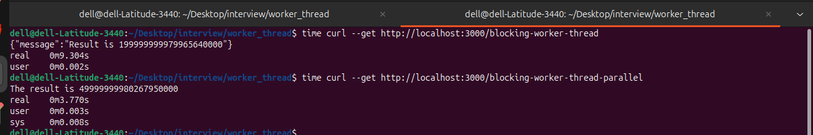

### What are Worker Threads in Node.js?
- Worker Threads allow Node.js to execute JavaScript code in separate threads.
- They are mainly used for CPU-intensive tasks so that the main Event Loop is not blocked.

```js
const { Worker } = require("worker_threads"); // Worker class
 
const worker = new Worker("./worker.js"); // Main class (import worker)
```

### Why do we need Worker Threads?
Since Node.js is single-threaded for JavaScript execution .
- To handle CPU-intensive tasks without blocking Node.js's main Event Loop.
- To keep the application responsive while heavy calculations run in the background.
- To utilize multiple CPU cores for parallel computation.
- Useful for tasks like image/video processing, large calculations, encryption, compression, and data processing.
- They help improve throughput and responsiveness for CPU-heavy workloads.

### When should you use Worker Threads?
Use them for CPU-bound operations, for example:
- Image processing
- Video processing
- Large calculations
- Encryption/decryption
- Data compression
- Parsing very large files
- Machine-learning calculations

### Worker Threads vs Child Process?
| Worker Thread                            | Child Process               |
| ---------------------------------------- | --------------------------- |
| Same Node.js process                     | Separate process            |
| Shares memory optionally                 | Separate memory             |
| Lightweight                              | Heavier                     |
| Communication via messages/shared memory | IPC                         |
| Good for CPU-intensive JS                | Good for isolated processes |
| Same process resources                   | Stronger isolation          |

### Worker Threads vs Cluster?
Cluster
- Used mainly to run multiple Node.js processes.

Worker Threads
- Used mainly for CPU-intensive work.

Cluster is generally used to <b>scale Node.js servers across CPU cores </b> by running <b>multiple processes</b>, whereas Worker Threads are mainly used to <b>move CPU-intensive JavaScript work away from the main Event Loop.</b>

### How does a Worker communicate with the main thread?
- using <b>parentPort.postMessage()</b>

Worker:
```js
const { parentPort } = require("worker_threads");

parentPort.postMessage("Hello from worker");
```

Main thread:
```js
const { Worker } = require("worker_threads");

const worker = new Worker("./worker.js");

worker.on("message", (data) => {
    console.log(data);
});
```

### What is workerData?

- <b>workerData</b> allows you to send initial data when creating a worker.
- workerData is generally initial data passed when the Worker starts.

Worker:
```js
const { workerData } = require("worker_threads");
console.log(workerData.number);
```
Main thread:
```js
const { Worker } = require("worker_threads");

const worker = new Worker("./worker.js", {
    workerData: {
        number: 100
    }
});
```
### What is parentPort?
- <b>parentPort</b> is used inside a worker to communicate with the parent/main thread.

Worker:
```js
const { parentPort } = require("worker_threads");
parentPort.postMessage("Done");
```

### What happens if a Worker throws an error?
Worker thread throws an error, the behavior depends on whether the error is caught within the worker or escapes to the main thread.

1. Uncaught Exceptions in the Worker If a worker throws an uncaught exception (synchronous or unhandled promise rejection), the worker thread terminates immediately. The main thread can detect this via the error event on the Worker instance. 

2. Handling via Events Standard practice involves attaching listeners to the Worker instance to handle failures gracefully:

    - <b>error</b>: Emitted if the worker throws an uncaught exception. 
    - <b>exit</b>: Emitted when the worker stops, allowing you to check the exit code (non-zero indicates failure). 

### What is the exit event?
- The exit event is emitted when the worker stops.
```js
worker.on("exit", (code) => {
    console.log("Worker exited:", code);
});
```

### Can Worker Threads share memory?
- Yes.
- Normally, data is communicated through messages, but <b>SharedArrayBuffer</b> and <b>Atomics</b> to  allows workers to access shared memory.

### What is SharedArrayBuffer?
- <b>SharedArrayBuffer</b> provides memory that can be shared between threads.
- Multiple workers can access that shared memory.
```js
const sharedBuffer = new SharedArrayBuffer(4);
const array = new Int32Array(sharedBuffer);
```
### What is Atomics?
- <b>Atomics</b> provides operations that are safe when multiple threads access shared memory.
- Atomics provides <b>thread-safe</b> operations on shared memory used with <b>SharedArrayBuffer</b> and helps <b>prevent race conditions</b>.
```js
Atomics.add(array, 0, 1);
```
### Does Worker Thread make Node.js completely multithreaded?
- Node.js still has a main Event Loop, but Worker Threads allow JavaScript code to execute concurrently on multiple threads.
- ✅ Node.js provides Worker Threads for parallel CPU-bound JavaScript execution.

### Are Worker Threads useful for database queries?
- No
- That is I/O-bound.
- Node.js can handle I/O asynchronously without blocking the Event Loop.

### What is a Worker Pool?
- Creating a new Worker for every request can be expensive.
- Instead, we can maintain a pool:
- Incoming jobs are distributed among available workers.
- This is called a Worker Pool.

Worker Pool\
+---------+\
| Worker1 |\
+---------+\
| Worker2 |\
+---------+\
| Worker3 |\
+---------+\
| Worker4 |\
+---------+

 "I created a fixed number of Worker Threads when the application starts and maintained a simple job queue. When a worker becomes free, I assign the next job from the queue and reuse the same worker instead of creating a new thread for every request."

### Why shouldn't we create a new Worker for every request?
- If you receive 10,000 requests:
```js
10,000 requests
       ↓
10,000 Workers ❌
```
This can cause:
- High memory usage
- Worker creation overhead
- CPU contention
- Poor performance

### How many Worker Threads should you create?
- There isn't one fixed number.
- Usually you consider the number of available CPU cores:
```js
const os = require("os");
console.log(os.cpus().length);
```

### Is Worker Thread asynchronous?
- Yes, from the main thread's perspective.
- The main thread doesn't wait synchronously for the worker.

### Explain your Worker Thread example
- I used Node.js Worker Threads to move a CPU-intensive calculation away from the main Event Loop.
- I created multiple workers, passed initial configuration using <b>workerData</b>, collected the results using the worker <b>message</b> event, and used <b>Promise.all()</b> to wait for all workers before combining the results.


```JS
Worker Thread → CPU-heavy task
Cluster       → Scale Node processes
Child Process → Separate process/isolation
Event Loop    → I/O and request handling
Worker Pool   → Reuse workers
SharedBuffer  → Shared memory
Atomics       → Safe shared-memory operations
```